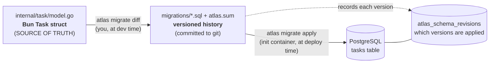
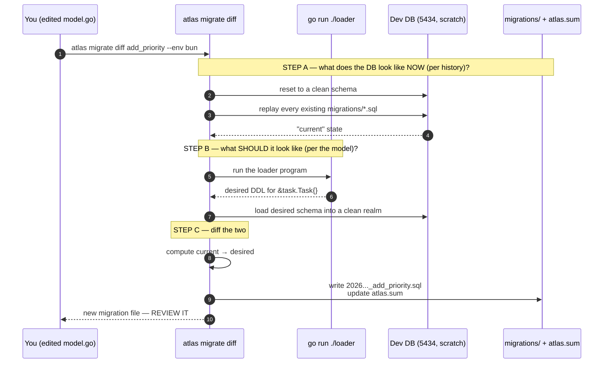
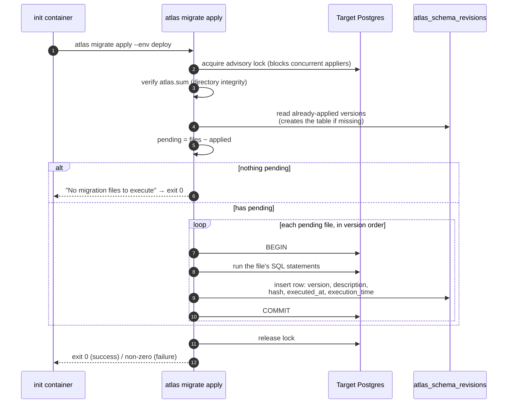
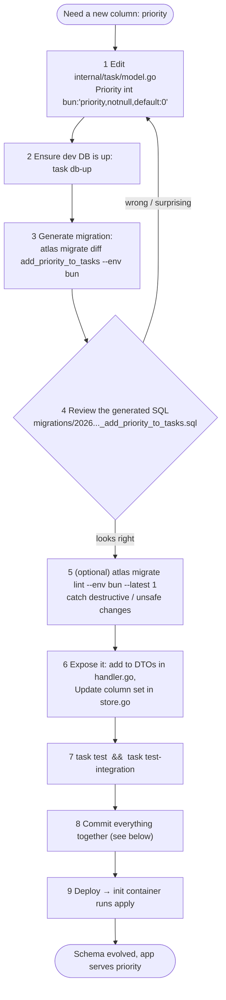
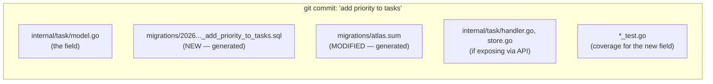
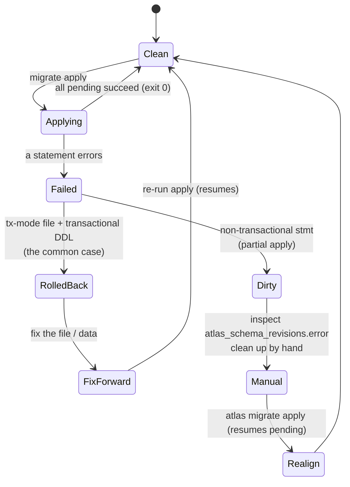
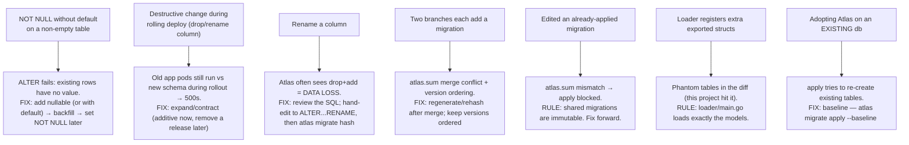
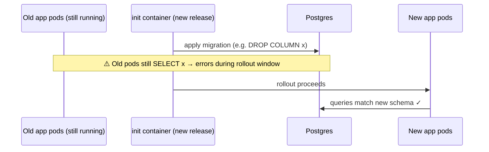

# Migrations Guide — Atlas + Bun

How schema migrations work in this project: how to add a column, what to commit,
what commands to run, how migrations are applied and tracked, how to handle a
failed migration, and the gotchas worth knowing before you hit them.

This complements the [README](../README.md) (which covers the local dev loop and
deployment). Everything here is grounded in *this* project: `internal/task/model.go`
is the source of truth, Atlas runs in **loader mode** against a podman dev DB on
port 5434, and migrations are applied in production by a dedicated init container.

---

## 1. The mental model — one source of truth, two derived artifacts

The single most important idea: **your Bun struct is the source of truth.** You
never write SQL by hand. Atlas *derives* versioned SQL from the struct, and a
database *consumes* that SQL.



Two distinct phases, run by two different actors at two different times:

| Phase        | Command              | Who runs it          | When                    | Needs                          |
| ------------ | -------------------- | -------------------- | ----------------------- | ------------------------------ |
| **Generate** | `atlas migrate diff` | you, a developer     | dev time, your machine  | dev DB (5434) + the Go loader  |
| **Apply**    | `atlas migrate apply`| migration init container | deploy time, in k8s | only the target DB URL         |

This split is why there are two Docker images. The app image never touches schema.

---

## 2. How `migrate diff` actually works (the clever part)

When you change the struct and run `atlas migrate diff`, Atlas needs to answer:
*"what SQL turns the current schema into the desired schema?"* It computes this
using the **dev database (5434) as a scratch pad** — never your real data.



The key insight: Atlas knows the "current" state by **replaying your committed
migration files** onto the throwaway dev DB, not by inspecting production. That's
why the dev DB must be up for `diff`, and why it can be empty/scratch — it gets
reset every time.

> **This is exactly why the loader-mode bug happened during the build.** In
> standalone mode, the loader emitted DDL for *every* exported struct (including
> `Handler`), so "desired" contained a phantom `handlers` table and the diff tried
> to create it. Loader mode fixes "desired" to exactly `&task.Task{}`.

---

## 3. How `migrate apply` works and how Atlas tracks changes

Apply runs against a **real** database (your app DB, or production). Atlas tracks
what's been applied in a table it creates and owns: **`atlas_schema_revisions`**.



**`atlas_schema_revisions`** is the ledger. One row per applied migration, roughly:

| column                      | meaning                                                  |
| --------------------------- | -------------------------------------------------------- |
| `version`                   | the migration's timestamp id (e.g. `20260605110617`)     |
| `description`               | the name (`add_due_date_to_tasks`)                       |
| `applied` / `total`         | statements applied vs total in the file                  |
| `executed_at`, `execution_time` | when + how long                                      |
| `hash`                      | checksum of the file as applied (tamper detection)       |
| `error` / `error_stmt`      | populated only if it failed                              |

Two safety mechanisms ride along:

- **`atlas.sum`** — a checksum manifest of the migrations *directory*. Apply
  refuses to run if a committed file was edited after the fact (history
  tampering). This is why `atlas.sum` **must be committed** and never hand-edited.
- **Advisory lock** — only one applier at a time. Critical with multiple k8s
  replicas: each pod's init container tries to apply, but they serialize; the
  first applies, the rest see "nothing pending."

---

## 4. The day-to-day: how you add a column

Concrete example — add a `priority int` to tasks.



### The commands

```bash
# 1. edit model.go (add the field) — then:
task db-up                                              # dev DB (5434) must be running

# 2. generate — pass a NAME so the file is self-describing.
#    With the Taskfile tweak you can forward the name:
task migrate-diff -- add_priority_to_tasks
#    ...which runs: atlas migrate diff add_priority_to_tasks --env bun

# 3. review the new file, then sanity-check tests
task test
task test-integration

# 4. (optional but recommended) lint for unsafe changes
atlas migrate lint --env bun --latest 1
```

### What you commit (all in one commit)



The non-negotiables: **the new `.sql` file + the updated `atlas.sum`** must be
committed together with the model change. If you commit the model change but
forget the migration, the next person's `diff` will "rediscover" your change —
drift. If you commit the `.sql` but not `atlas.sum`, apply will fail the
integrity check.

---

## 5. What to do when a migration fails

Good news: **Postgres has transactional DDL**, and Atlas's default `--tx-mode
file` wraps each migration file in a transaction. So a failed statement normally
rolls back the *whole file* — the DB stays clean and you just fix-forward.



**The decision that governs everything: has this migration been applied to a
*shared* environment yet?**

- **No (only failed locally / in CI, never succeeded anywhere):** you may edit the
  `.sql` file to fix it, then **re-hash**: `atlas migrate hash` (updates
  `atlas.sum`), and re-run.
- **Yes (it ran on staging/prod):** **never edit it.** Migrations are immutable
  once shared. Fix forward with a *new* migration that corrects the problem.

Practical recovery steps when an apply fails in k8s:

1. The init container exits non-zero → the pod stays in `Init:Error` and the app
   container never starts. **This is a feature** — a bad schema never gets a
   running app on top of it.
2. Inspect: `kubectl logs <pod> -c migrate`, and query
   `SELECT version, error, error_stmt FROM atlas_schema_revisions WHERE error IS NOT NULL;`
3. If it rolled back cleanly (transactional): fix forward (new migration or
   corrected unshared file), rebuild the migrate image, redeploy.
4. If partially applied (a non-transactional statement like
   `CREATE INDEX CONCURRENTLY`): you must reconcile the DB by hand, then let Atlas
   resume. Atlas refuses to proceed while the revision row shows an error until the
   state is consistent.

---

## 6. Gotchas — the stuff that bites in production



A few expanded, because they matter most for the k8s setup:

### ① Rolling deploys need backward-compatible schema (expand/contract)

The init container applies the new schema *before* the new app pods are fully
rolled out — but during a rolling update, **old app pods are still serving against
the new schema**. If a migration drops or renames a column the old code still
selects, those pods throw errors until they're replaced.



The safe pattern is **expand → migrate → contract across two releases**:

- Release 1 (expand): add the new column (nullable/additive). Deploy code that
  writes both old + new. Backfill.
- Release 2 (contract): stop using the old column. Drop it.

Adding a nullable column (like `due_date`) is already safe — it's purely additive.
Dropping/renaming is where you need the two-step dance.

### ② `NOT NULL` on an existing table

`ALTER TABLE tasks ADD COLUMN priority int NOT NULL` fails if rows exist. Either
give it `default:0` (the bun tag can: `bun:"priority,notnull,default:0"` → Atlas
emits `DEFAULT 0`), or add nullable, backfill, then tighten.

### ③ Renames look like data loss

If you rename `title` → `name` in the struct, Atlas diff typically generates
`DROP COLUMN title; ADD COLUMN name` — losing data. Always **review** the
generated SQL; for a true rename, hand-edit to `ALTER TABLE ... RENAME COLUMN`,
then run `atlas migrate hash` so `atlas.sum` matches.

### ④ Always review and lint

`atlas migrate diff` is mechanical; it doesn't know intent. `atlas migrate lint
--env bun --latest 1` flags destructive/irreversible/locking changes before they
reach prod.

### ⑤ `updated_at` is app-set, not DB-set here

The handler sets `updated_at` in Go on update; there's no DB trigger. So
migrations won't add one — if you ever want DB-enforced `updated_at`, that's a
deliberate migration (a trigger), not something Atlas derives from the struct.

---

## 7. Cheat sheet

```bash
# --- inspect ---
task migrate-status                         # what's applied to the app DB
atlas migrate status --env bun -u "$DATABASE_URL"

# --- evolve the schema (dev time) ---
task db-up                                  # dev DB must be up for diff
task migrate-diff -- <descriptive_name>     # atlas migrate diff <name> --env bun
atlas migrate lint --env bun --latest 1     # safety check
atlas migrate hash                          # ONLY if you hand-edited an unshared migration

# --- apply (locally) ---
task migrate-apply                          # → app DB on 5433

# --- apply (production) = the init container does this automatically ---
#   atlas migrate apply --env deploy        (reads DATABASE_URL via getenv)

# --- adopting Atlas on a pre-existing DB ---
atlas migrate apply --env deploy --baseline <existing_version>
```

**The golden rules:**

1. Model is the source of truth → never hand-write migrations.
2. Commit the `.sql` **and** `atlas.sum` with the model change, atomically.
3. Shared migrations are immutable → fix forward, never edit.
4. Review (and lint) every generated migration before committing.
5. Additive changes are safe; destructive changes need expand/contract across releases.
